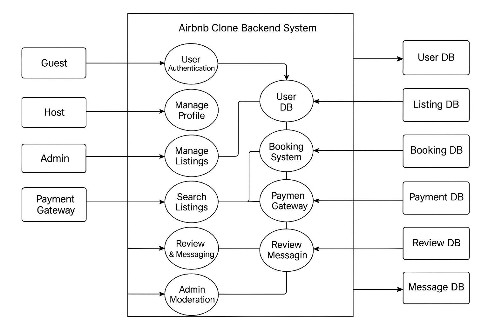

# Data Flow Diagram — Airbnb Clone (Backend)

This directory contains the **Data Flow Diagram (DFD)** for the Airbnb Clone backend system.

---

## Overview
The diagram illustrates how **data flows** between external entities, backend processes, and data stores in the system.

---

## Key Entities
- **Guest** – browses, books, pays, and reviews.
- **Host** – creates and manages property listings, updates availability, receives payouts.
- **Admin** – manages users and listings, moderates activity.
- **Payment Gateway** – external system for secure payment processing.

---

## Core Processes
- **User Authentication & Profile Management**
- **Property Management** (create, update, delete listings, manage availability)
- **Search & Discovery** (guests searching properties)
- **Booking System** (reserve, cancel, update bookings)
- **Payment Processing** (guest payments, host payouts)
- **Reviews & Messaging** (guests ↔ hosts communication, ratings)
- **Admin Moderation** (remove listings, suspend users)

---

## Data Stores
- **User DB** – user accounts, profiles, roles
- **Listing DB** – property details, availability calendars
- **Booking DB** – reservations and cancellations
- **Payment DB** – transactions, payouts, refunds
- **Review DB** – guest and host reviews
- **Message DB** – in-app communications

---

This DFD helps visualize the backend workflows and data interactions that power the Airbnb Clone project.
