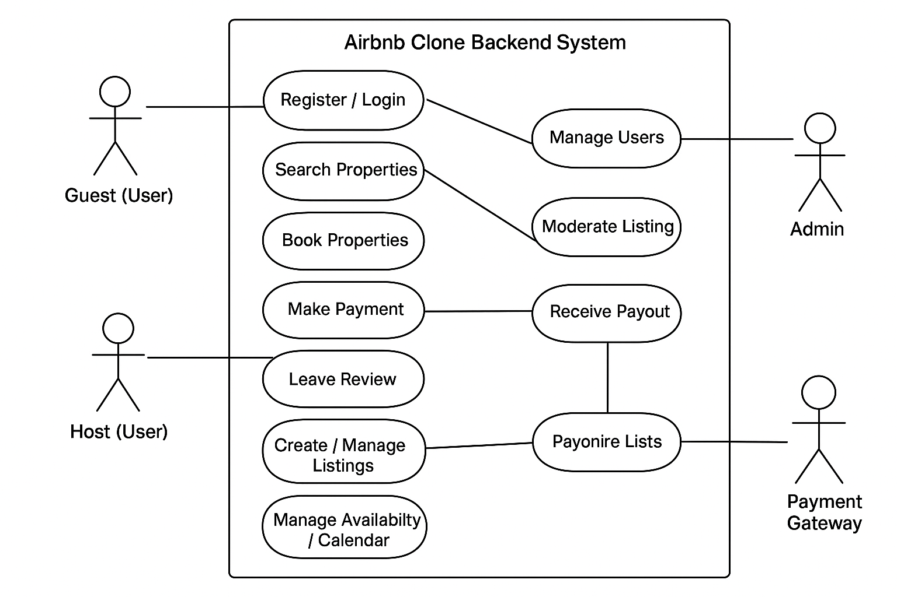

# Use Case Diagram — Airbnb Clone (Backend)

This diagram visualizes the main interactions between **actors** (users and external systems) and the **Airbnb Clone backend system**.

---

## Actors
- **Guest (User)** – registers, searches for properties, books, makes payments, leaves reviews.
- **Host (User)** – registers, creates/manages listings, manages availability, receives payouts.
- **Admin** – moderates listings, manages users, handles disputes.
- **Payment Gateway (External System)** – processes guest payments and host payouts.

---

## Key Use Cases
- **Authentication**
  - Register / Login
  - Manage Profile
- **Property Management (Host)**
  - Create / Manage Listings
  - Manage Availability / Calendar
- **Property Discovery (Guest)**
  - Search Properties
  - View Availability
- **Booking**
  - Book Property
  - Cancel Booking
- **Payments**
  - Make Payment (Guest → Payment Gateway)
  - Receive Payout (Host ← Payment Gateway)
- **Reviews & Messaging**
  - Leave Review
  - Send / Receive Messages
- **Administration**
  - Moderate Listings
  - Manage Users
  - Handle Disputes
